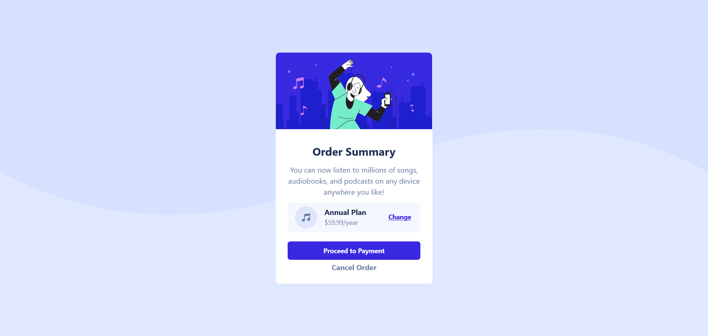

# Frontend Mentor - Order summary card solution

This is a solution to the [Order summary card challenge on Frontend Mentor](https://www.frontendmentor.io/challenges/order-summary-component-QlPmajDUj). Frontend Mentor challenges help you improve your coding skills by building realistic projects. 

## Table of contents

- [Overview](#overview)
  - [The challenge](#the-challenge)
  - [Screenshot](#screenshot)
  - [Links](#links)
- [My process](#my-process)
  - [Built with](#built-with)
  - [What I learned](#what-i-learned)
  - [Continued development](#continued-development)
  - [Useful resources](#useful-resources)
- [Author](#author)

## Overview

### The challenge

Challenge should be able to:

- See hover states for interactive elements
- mostly the interactiveness of background image

### Screenshot

### Links

- Solution URL: [solution URL](https://your-solution-url.com)
- Live Site URL: [live site URL](https://your-live-site-url.com)

## My process

### Built with

- Semantic HTML5 markup
- CSS custom properties
- Flexbox
- Mobile-first workflow
- [Tailwindcss](https://tailwindcss.com) - Css framework

### What I learned

- I learn to use background image and its properties.

- how to center elements using flex like layouts.

### Continued development

1. **Mastery of Tailwind CSS:**

Advancing proficiency in streamlined styling and the creation of responsive designs.

2. **Crafting Responsive Layouts:**

Elevating skills in designing layouts that adapt seamlessly to various devices.

### Useful resources

- [Html and css resouce:1](https://htmlandcssguidebook.com/) - This helped me for refering and rework. I really liked this pattern and will use it going forward.
- [Css Flexbox resource:2](https://htmlandcssguidebook.com/) - This helped me for responsive design specific to flexbox.
- [Tailwind resource:3](https://tailwindcss.com) - This is an tailwind documentation and this is enough to get better at this skill. I'd recommend it to anyone still learning this concept.

## Author

- Website - [Yogesh](https://yogesh-portfolio.dev)
- Frontend Mentor - [@yogesh-stack-dev](https://www.frontendmentor.io/profile/yogesh-stack-dev)
- Twitter - [@YOGESHISACTIVE](https://www.twitter.com/YOGESHISACTIVE)
